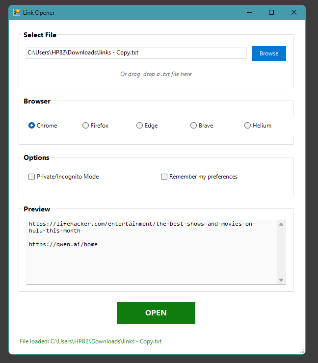

# 🔗 Link Opener v2.0.0 — Open Multiple URLs Instantly

Link Opener is a **lightweight, open-source Windows desktop application** that lets you open multiple URLs at once using a simple, modern **C# WPF interface**.  
Perfect for **developers, researchers, marketers**, and anyone who works with dozens of links daily.

---

## 🖼 Screenshot

<p align="center">
  
</p>

Clean, modern **Light Theme interface** — load links, choose a browser, and open everything with one click.

---

## 🚀 What is Link Opener?

**Link Opener** is a small desktop tool that saves time by launching multiple websites simultaneously from a `.txt` file.  
Built with **C# and WPF (.NET 8.0)**, it is highly optimized, requires the **.NET 8.0 Desktop Runtime**, and supports five browsers:
**Chrome, Firefox, Edge, Brave, and Helium.**

---

## ✨ Features

- 💻 **Rewritten in C# WPF:** Faster, more stable, and fully native to Windows.  
- 🎨 **Light Theme (v2.0):** Clean, modern, and high-contrast user interface.  
- 🌐 **Multi-Browser Support:** Works with Chrome, Firefox, Edge, Brave, and Helium.  
- 🔒 **Private Mode Option:** Open all links in Incognito or Private mode.  
- 📂 **File Handling:** Load URLs via file picker or Drag & Drop a `.txt` file.  
- 💾 **Persistent Settings:** Remembers your last-used browser and preferences.  
- ⚡ **Optimized Performance:** Fast link processing thanks to the .NET framework.

---

## 🛠 How to Use

### 1️⃣ Prepare your URLs

Create a file named `links.txt` with **one URL per line**:

```text
https://github.com
https://stackoverflow.com
https://news.ycombinator.com
```

2️⃣ Run the App

Launch LinkOpener.exe.

3️⃣ Load Your File

Click Browse or simply Drag & Drop your .txt file into the window.

4️⃣ Select Browser & Mode

Choose your browser and toggle Private Mode if desired.
5️⃣ Click OPEN

Instantly open all your links in separate browser tabs.
---

## ⬇️ Download & Requirements

📦 The latest optimized package is available for direct download:  
👉 [Download Link Opener v2.0.0](https://github.com/Chan9001/LinkOpener/releases/tag/v2.0)

**Requirements:**
- Windows 10 / 11 (64-bit)
- [.NET 8.0 Desktop Runtime](https://dotnet.microsoft.com/en-us/download/dotnet/8.0)

---

## 🧠 Technical Details

| Property | Description |
|-----------|--------------|
| **Language** | C# |
| **Platform** | Windows 10 / 11 (64-bit) |
| **Framework** | WPF / .NET 8.0 |
| **Dependencies** | .NET 8.0 Desktop Runtime |
| **License** | MIT Open Source |
| **Supported Browsers** | Chrome, Firefox, Edge, Brave, Helium |

This repository contains the **full C# source code** for review and modification.

---

## 🧩 Why It’s Useful

✅ Quickly open all your daily work or research tabs.  
✅ Ideal for **social media managers, developers, QA testers, and data researchers**.  
✅ Save time, stay organized, and reduce repetitive browser actions.

---

## 🧑‍💻 About the Author

**Created by HC**  
Passionate about productivity tools, automation, and open-source development.

📜 **License:** MIT  
⭐ If you find this project helpful, please **star the repository** — it supports visibility and future updates.

---

## 🔍 SEO Tags

`windows link opener`, `open multiple urls`, `url opener tool`, `csharp wpf gui`,  
`batch link opener`, `multi-browser opener`, `link opener app`,  
`github open source tool`, `chrome firefox edge opener`,  
`open multiple tabs at once`, `.net 8.0 wpf`

---

  </a>
</div>
