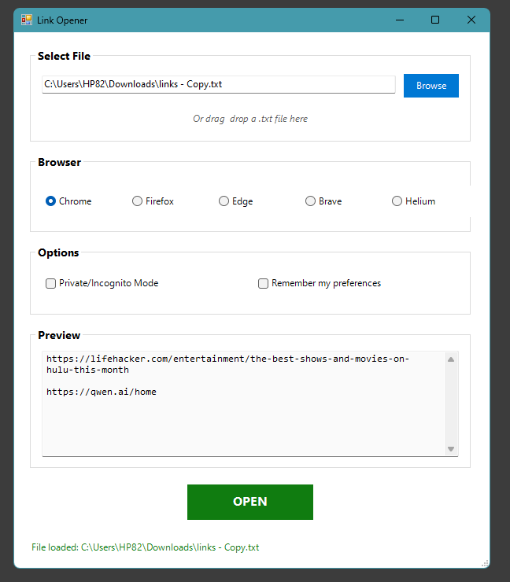

# 🔗 Link Opener v1.0.0 — Open Multiple URLs Instantly

**Link Opener** is a lightweight, open-source **Windows application** that lets you **open multiple URLs at once** using a simple, intuitive **PowerShell-based GUI**.  
Perfect for developers, researchers, marketers, and anyone who works with dozens of links daily.

---

## 🖼 Screenshot

  

*Clean and modern interface — load links, choose a browser, and open everything with one click.*

---

## 🚀 What is Link Opener?

**Link Opener** is a small, portable desktop tool that saves time by launching multiple websites simultaneously from a `.txt` file.  
Built with **PowerShell** and compiled into a **standalone EXE**, it requires **no installation** and supports **five browsers**: Chrome, Firefox, Edge, Brave, and Helium.

---

## ✨ Features

- 🪟 **Simple GUI:** Clean, fluent design that’s easy to use.  
- 🌐 **Multi-Browser Support:** Works with Chrome, Firefox, Edge, Brave, and Helium.  
- 🔒 **Private Mode Option:** Open all links in Incognito or Private mode.  
- 📂 **File Handling:** Load URLs via file picker or **Drag & Drop** a `.txt` file.  
- 💾 **Persistent Settings:** Remembers your last-used browser and preferences.  
- ⚡ **Portable & Fast:** No installer, no dependencies - just run and use.  
- 🧩 **Open Source:** 100% transparent PowerShell code available for review.  

---

## 🛠 How to Use

1. **Prepare your URLs**  

<strong>Create a <code>links.txt</code> file with one URL per line:</strong>

<pre>
https://github.com
https://stackoverflow.com
https://news.ycombinator.com
</pre>

2. **Run the App**  
Launch `Link Opener.exe`.

3. **Load Your File**  
Click **Browse** or simply **Drag & Drop** your `.txt` file into the window.

4. **Select Browser & Mode**  
Choose Chrome, Firefox, etc., and toggle **Private Mode** if desired.

5. **Click OPEN**  
Instantly open all your links in tabs.

---

## ⬇️ Download

📦 The latest portable `.exe` is available for direct download:  
👉 [**Download Link Opener v1.0.0**](https://github.com/Chan9001/LinkOpener/releases/latest)

No installation required — just download and run.

---

## 🧠 Technical Details

- **Language:** PowerShell  
- **Platform:** Windows 10 / 11  
- **Framework:** .NET 4.5+  
- **License:** MIT Open Source  
- **Browsers Supported:** Chrome, Firefox, Edge, Brave, Helium  

This repository also includes the original PowerShell script (`Link Opener.ps1`) for those who wish to view, modify, or rebuild the executable.

---

## 🧩 Why It’s Useful

- Quickly open all your daily work or research tabs.  
- Ideal for social media managers, developers, QA testers, and data researchers.  
- Save time, stay organized, and reduce repetitive browser actions.  

---

## 🧑‍💻 About the Author

Created by HC
Passionate about productivity tools, automation, and open-source development.  

📜 License: [MIT](https://opensource.org/licenses/MIT)  
⭐ If you find this project helpful, **star the repository** — it supports visibility and future updates.

---

### 🔍 SEO Tags

`windows link opener`, `open multiple urls`, `url opener tool`, `powershell gui`, `batch link opener`, `multi-browser opener`, `link opener app`, `github open source tool`, `chrome firefox edge opener`, `open multiple tabs at once`
---

## 💖 Support Development

If you find **Link Opener** useful, please consider supporting its development:

    <a href="https://www.paypal.com/cgi-bin/webscr?cmd=_s-xclick&hosted_button_id=Q7NJC5CSRNF2Y" target="_blank" style="
        display: inline-block;
        padding: 10px 25px;
        background-color: #00457C; /* PayPal plava boja */
        color: white;
        text-decoration: none;
        font-weight: bold;
        border-radius: 4px;
        box-shadow: 0 2px 4px rgba(0,0,0,0.2);
    ">
        ✨ DONATE via PayPal
    </a>
<<<<<<< HEAD

=======

>>>>>>> e0ef0851008882e4049323894003cf0a2a628252
